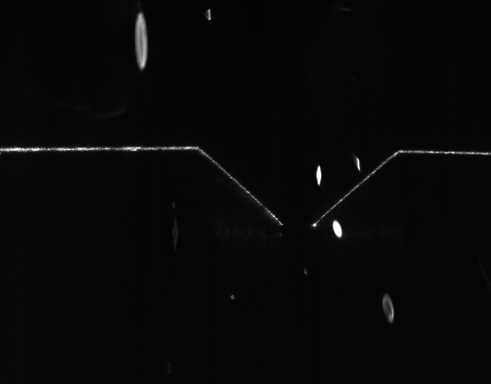

# LaserLineTracking
A Keras implementation of dynamic programming for shortest path tracking.
---

It is possible to implement dynamic programming in Keras layers to take advantage of GPU acceleration for laser line tracking.

Laser tracking is important in a wide variety of applications: seam tracking (for automated welding robots), self driving vehicles (to determine distances and road shape), 3D scanning and others.

Below is a sample of how the processing results:

## C# and OpenCL

If you are interested in a complete version of this code using C# and OpenCL feel free to browse through the .cs classes.

## To do:

(I have this code implemented in C/C# and OpenCL for a different application. I will port the code to Python if and when the need arises or if someone requests the features).

[ ] Embed backtracking in Keras

[ ] Carry information from more than 1 pixel above/below (influences the max slope of the tracked line - for 1 pixel the max slope is 45 degrees. For 2 pixels it increases to 63 degrees)

[ ] Compute the best N lines from the backtracked points

[ ] Track two or more lines simultaneously.
